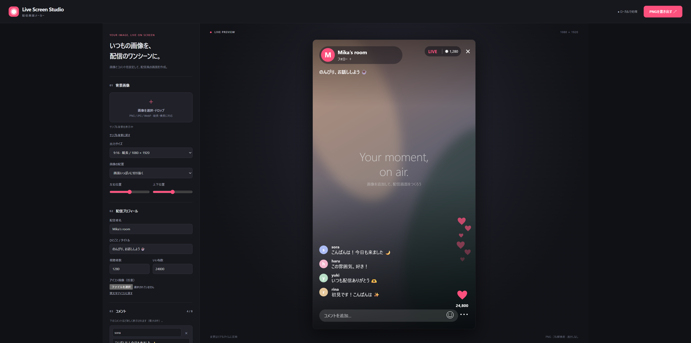

# Live Screen Studio

このツールは、ユーザーの指示に基づいてOpenAIのCodexで生成・改修しました。

[ブラウザーでLive Screen Studioを使う](https://kawauso3gouki.github.io/live-screen-studio/)

上のリンクからインストール不要で使えます。ダウンロードした `index.html` をブラウザーで開けば、サーバー・インターネット接続なしでも使えます。

1. PNG / JPG / WebP画像を選択、またはドロップします。
2. 出力サイズ（9:16 / 16:9）、配置、切り抜き位置を調整します。画像読み込み時は縦横を自動選択します。
3. 配信者名、タイトル、視聴者数、いいね数、アイコン、コメントを編集します。「入力中のコメント」で画面下の入力欄も変更できます。空欄なら「コメントを追加…」を表示します。
4. アクセントカラー、暗さ、UIサイズ、表示項目を調整します。
5. 「PNGを書き出す」で1080×1920または1920×1080の画像を保存します。

「設定を保存」「設定を読み込む」で画像込みのJSONを保存・復元できます。編集中の内容は自動保存されません。

コメントは最大8件。表示領域に収まる新しいコメントを下から表示し、長文は末尾を省略します。横長・大きなUIでは表示件数が減ります。いいね・コメントは画面用の設定値です。実際の配信やSNSとの接続機能はありません。

画像処理・PNG生成はブラウザー内で完結します。外部ライブラリや外部通信は使いません。
